# Microserviço LangChain com Azure OpenAI

## 🚀 Visão Geral

Este projeto implementa um microserviço cloud native em Python, utilizando FastAPI e LangChain Agent, integrado com Azure OpenAI e Azure Cosmos DB. O serviço persiste prompts e respostas para análises futuras e retorna respostas em tempo real ao usuário.

## 💻 Tecnologias Utilizadas

- Python 3.11+
- FastAPI
- LangChain (Agent)
- Azure OpenAI (via AzureChatOpenAI)
- Azure Cosmos DB

## ⚙️ Como Executar

1. Clone o repositório:
git clone https://github.com/hsouzaeduardo/CASE-HENRIQUE-SOUZA.git

2. Crie e ative um ambiente virtual:
# Linux/Mac 
python -m venv venv source venv/bin/activate 
# Windows
venv\Scripts\activate

3. Instale as dependências:
pip install -r requirements.txt

uvicorn main:app --reload

## Executar Dockerfile
docker build -f .devops/dockerfile -t agent-chat:latest .

docker run -p 8000:8000 --env-file .env agent-chat:latest

## 📦 Estrutura do Projeto

## 📝 Funcionalidades

- Recebe prompts via API REST.
- Processa prompts usando LangChain Agent e Azure OpenAI.
- Persiste prompts e respostas no Azure Cosmos DB.
- Retorna respostas em tempo real.

## Licença
Este projeto está sob a licença MIT.

## O que falta Implementar ?
Obervabilidade

### .ENV

### Azure OpenAI Configuration
AZURE_OPENAI_ENDPOINT=https://<seu-endpoint>.openai.azure.com/
AZURE_OPENAI_API_VERSION=2024-12-01-preview
AZURE_OPENAI_DEPLOYMENT_NAME=gpt-4o-mini
AZURE_OPENAI_API_KEY=<sua-chave-aqui>

### Cosmos DB Configuration

COSMOS_ENDPOINT=https://<seu-endpoint-cosmos>.documents.azure.com:443/
COSMOS_KEY=<sua-chave-cosmos-aqui>
COSMOS_DATABASE_NAME=caseitau
COSMOS_CONTAINER_NAME=chats

### App Configuration
APP_NAME=AI Agent API
DEBUG=false

### Server Configuration
HOST=0.0.0.0
PORT=8000
RELOAD=false
LOG_LEVEL=info

# Fluxo de Funcionamento Básico

```mermaid
sequenceDiagram
    participant User
    participant AppGateway as Application Gateway
    participant APIGW as API Gateway
    participant ChatAPI as chat-api
    participant Agent as Agent Chat
    participant Redis as Redis
    participant LLM as OpenAI
    participant DB as CosmosDB

    User->>AppGateway: Envia requisição (prompt)
    AppGateway->>APIGW: Encaminha requisição
    APIGW->>ChatAPI: Valida e encaminha
    ChatAPI->>Agent: Passa prompt
    Agent->>Redis: Verifica cache (resposta prévia?)
    alt Resposta encontrada
        Redis-->>Agent: Retorna resposta
        Agent-->>ChatAPI: Envia resposta pronta
        ChatAPI-->>APIGW: Retorna resposta ao usuário
        APIGW-->>AppGateway: Retorna
        AppGateway-->>User: Retorna resposta
    else Sem resposta no cache
        Agent->>LLM: Envia prompt ao OpenAI
        alt LLM responde OK
            LLM-->>Agent: Retorna resposta
            Agent->>DB: Persiste no CosmosDB
            Agent-->>ChatAPI: Retorna resposta final
            ChatAPI-->>APIGW: Retorna ao usuário
            APIGW-->>AppGateway: Retorna
            AppGateway-->>User: Retorna resposta
        else Timeout ou falha
            Agent-->>ChatAPI: Retorna "Em processamento"
            ChatAPI-->>APIGW: Retorna status para usuário
            APIGW-->>AppGateway: Retorna
            AppGateway-->>User: Retorna status
            Agent->>DB: Atualiza prompt com status pendente
            Note right of User: Usuário consulta depois ou webhook notifica
        end
    end
```

